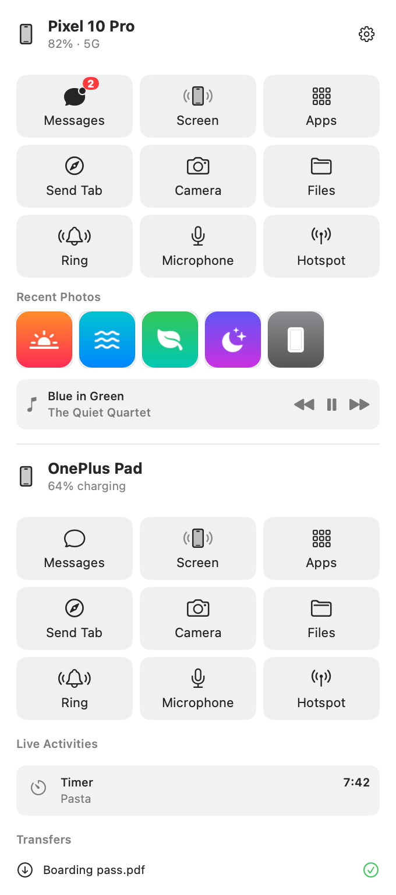
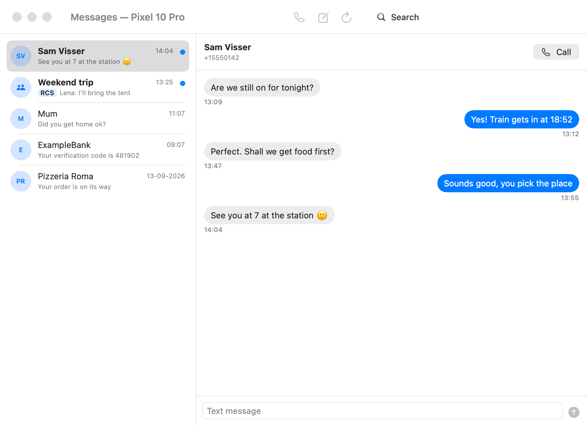
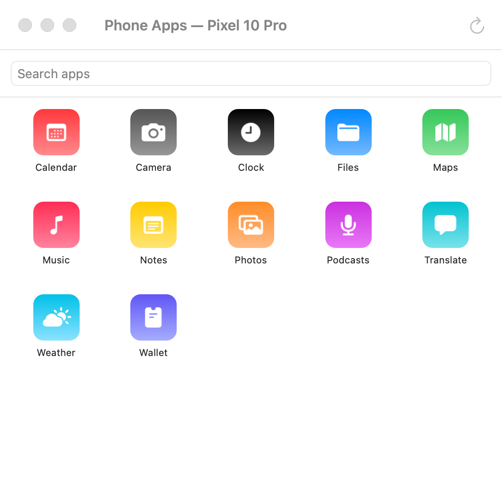
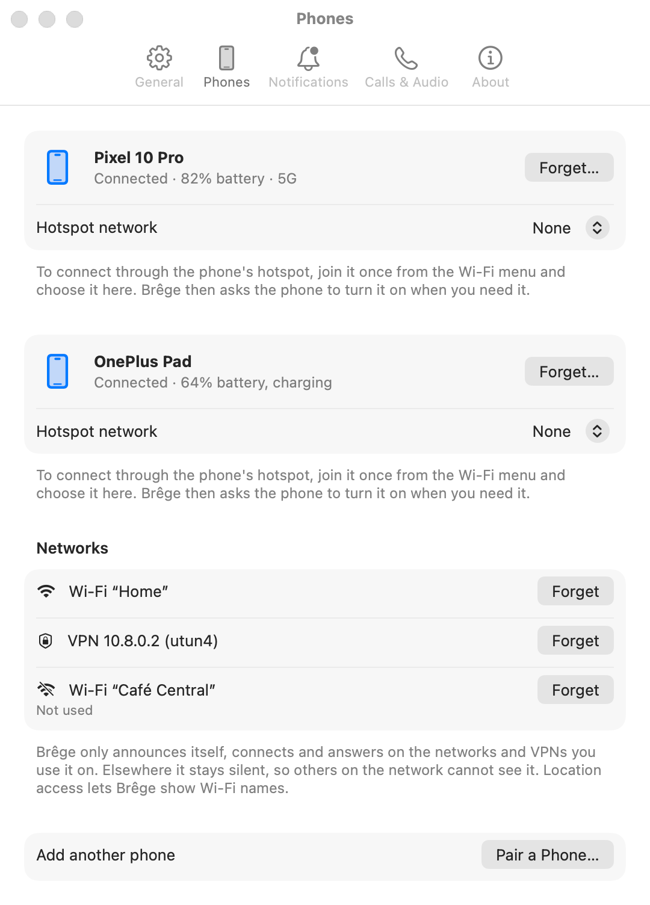
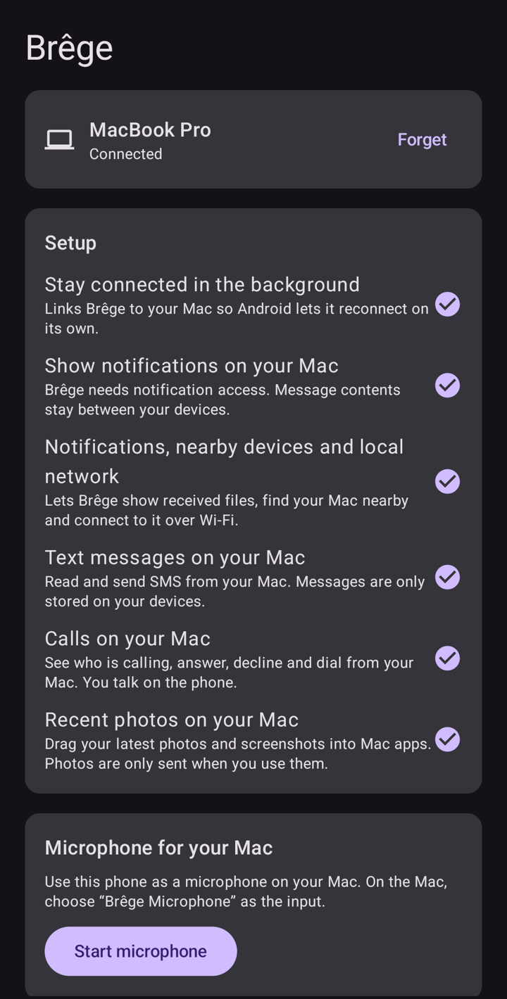
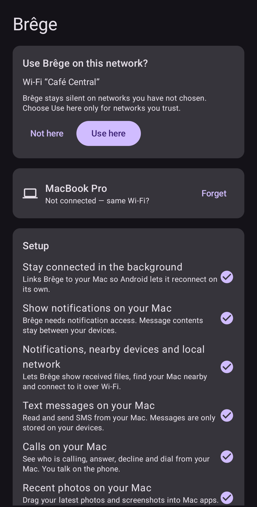
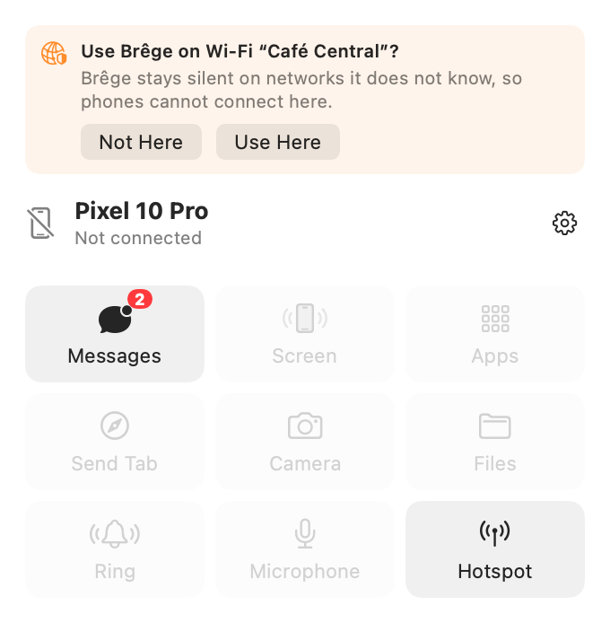

# Brêge

**Brêge** (Frisian for *bridge*) connects an Android phone to a Mac: messages and calls, notifications, the clipboard, files, the phone's screen, its camera and
microphone, and more — directly over your own network, without an account or a cloud service.

A menu bar app on the Mac, a companion app on the phone, and a shared Rust core that does the
networking, pairing and encryption.

<p align="center">
  <picture>
    <source media="(prefers-color-scheme: dark)" srcset="docs/screenshots/dark/menu.png">
    
  </picture>
</p>

> Screenshots show made-up phones, people and networks. They are rendered from the real app
> windows by `scripts/screenshots.sh`, which never reads real data (see [Screenshots](#screenshots)).

## What it does

**Messages and calls**
- Read and send SMS, and reply to RCS conversations, in a Messages window with contact photos.
- Incoming calls on the Mac with answer and decline; start calls from the Mac; missed calls with
  Call Back and Message.
- Optionally pause music on the Mac while the phone rings or is on a call.

**Notifications**
- Phone notifications as Mac notifications, with Reply, actions and dismiss.
- Verification codes are recognised and offered as Copy Code (optionally copied automatically).
- Ongoing phone activities (timers, navigation, deliveries) in the menu bar.
- Battery alerts for the phone.

**Clipboard, links and files**
- Shared clipboard in both directions.
- Send Tab: open the current Safari, Chrome, Edge, Brave or Arc page on the phone.
- Send files both ways: drop them on a phone in the menu, or share to Brêge on the phone.
- Phone folders you choose appear in Finder as a volume.
- Recent photos and screenshots from the phone in the menu: drag one into any app.
- Take a photo or scan a document with the phone straight into the app you are working in
  (right-click › Services, per phone).

**Screen, camera and audio**
- Mirror and control the phone's screen, or open a single phone app in its own window
  (uses the phone's wireless debugging; you install `adb` yourself).
- Use the phone's camera in a window on the Mac, and record video with sound.
- Use the phone as a microphone for any Mac app ("Brêge Microphone").
- Media controls for music on the phone; ring the phone to find it.

**Around the edges**
- Several phones at once, each with its own windows and menu entries.
- Ask the phone for its hotspot when the Mac has no Wi‑Fi; the Mac joins it automatically.
- Start at login.

<p align="center">
  <picture>
    <source media="(prefers-color-scheme: dark)" srcset="docs/screenshots/dark/messages.png">
    
  </picture>
</p>

<p align="center">
  <picture>
    <source media="(prefers-color-scheme: dark)" srcset="docs/screenshots/dark/phone-apps.png">
    
  </picture>
  &nbsp;
  <picture>
    <source media="(prefers-color-scheme: dark)" srcset="docs/screenshots/dark/settings-phones.png">
    
  </picture>
</p>

On the phone, Brêge is a single screen: the paired Mac, a setup checklist, and cards for the
microphone, the phone screen, shared folders and networks.

<p align="center">
  
  &nbsp;
  
</p>

## Privacy and security

Brêge has no server, no account and no analytics. Phone and Mac talk to each other directly.

- **Pairing** happens once: the phone scans a QR code shown by the Mac, and you confirm on the Mac.
  A pairing link opened on the phone asks for confirmation there too. Each device keeps its own
  key pair (Keychain on the Mac, Android Keystore on the phone); after pairing, each only accepts
  the other's exact key.
- **Every connection is encrypted and mutually authenticated** (QUIC with TLS 1.3 and pinned raw
  public keys). Messages, notifications and files are exchanged only after both sides have proven
  their identity. Two things come before that: on a network Brêge may use, the TLS handshake shows a
  device's public key to anyone who connects there, and while you pair, the pairing exchange (device
  names and a proof of the QR code's one-time token) runs before the keys are pinned.
- **Stored data** on the Mac (message cache, notification history, known networks) is in an
  encrypted database. The recent-photo cache and notification icons are ordinary files in the app's
  cache and temporary folders.
- **Brêge stays silent on networks you have not chosen.** On a network or VPN it does not know, it
  does not announce itself and does not try to connect. Packets from such networks are dropped at
  the socket before the connection layer sees them, so no reply of any kind goes out and the port
  looks closed. It asks first:

  <p align="center">
    <picture>
      <source media="(prefers-color-scheme: dark)" srcset="docs/screenshots/dark/menu-new-network.png">
      
    </picture>
  </p>

  - The Mac asks in its menu, and with a notification only when a phone is actually nearby. The
    phone asks inside its app, never with a notification.
  - A VPN (such as WireGuard) is used only after you allow it.
  - Your own actions are the exceptions: while the Mac shows a pairing code it uses any Wi‑Fi or
    Ethernet network, and during a hotspot request it uses the phone's hotspot Wi‑Fi.
  - Even on trusted networks, the Bonjour announcement is named "Brêge" (not after your Mac), uses
    a random host name instead of your Mac's, and carries only rotating ids that change every 15
    minutes and that only your paired phone can recognise; the host name changes along with them.
    The phone's Bluetooth presence signal rotates the same way.
- **adb stays optional.** Only the phone screen and app windows use wireless debugging; every other
  feature works without developer options.

## Requirements

- A Mac with macOS 13 or later.
- An Android phone with Android 10 or later (some features need newer versions; developed on
  Android 16 and 17).
- Both on the same network, or reachable through your own VPN.
- For the phone screen and app windows only: Android platform tools (`adb`), e.g.
  `brew install --cask android-platform-tools`.

## Build

Prerequisites: Rust (`rustup`), Android SDK with NDK 30 and platform 37, JDK 17, Swift 6
command-line tools. In a new terminal run `source ~/.cargo/env` first if rustup was installed
without editing your shell profile.

```sh
# Core: unit and end-to-end tests
cd core && cargo test --workspace && cd ..

# Mac: core and Swift bindings, then the app (→ macos/build/Brêge.app), then install to /Applications
scripts/build-core-apple.sh
scripts/build-macos-app.sh
scripts/install-macos-app.sh

# Android: core and Kotlin bindings, then the APK
scripts/build-core-android.sh
(cd android && ./gradlew assembleDebug)   # → android/app/build/outputs/apk/debug/app-debug.apk
adb install -r android/app/build/outputs/apk/debug/app-debug.apk
```

The Mac app is signed with a local development identity when one exists, otherwise ad hoc; macOS
then asks for Keychain access again after each rebuild.

## Set up

1. Open Brêge on the Mac. It lives in the menu bar; allow notifications, Bluetooth and Local Network.
2. On the Mac choose **Pair a Phone…**; on the phone open Brêge and tap **Scan pairing code**.
   Confirm on the Mac.
3. On the phone, work through the setup card: link the phone to the Mac, allow notification access
   and the permissions for the features you want (messages, calls, photos).
4. Optional:
   - **Phone screen and app windows:** turn on wireless debugging on the phone; Brêge walks you
     through pairing `adb` once.
   - **Phone hotspot:** choose the phone's hotspot network in Settings › Phones.
   - **Microphone:** click Microphone on the phone in the menu; Brêge installs its audio device once.
   - **Wi‑Fi names on the phone:** "Show Wi‑Fi names" in the phone app's Networks card.

## Screenshots

The images in this README are generated, not captured from a real session:

```sh
scripts/screenshots.sh           # Mac windows, light and dark, into docs/screenshots
scripts/screenshots.sh android   # phone app, on an unlocked phone with the debug build
```

The Mac app renders its own windows with `--screenshots <folder>`: it fills the views with made-up
phones, conversations, photos and networks and does not start its core, read the Keychain, look at
Wi‑Fi networks or show notifications. The Android debug build has a matching screenshot mode.

## Project layout

```
core/      Rust workspace: identity and pairing, transport, store, transfers, drive, features, FFI
macos/     SwiftPM package: the Brêge menu bar app, the Services helper, the microphone driver
android/   Gradle project (Kotlin, Jetpack Compose)
scripts/   Build, install, notices and screenshot scripts
docs/      Screenshots
```

## Status

Brêge is a personal project under active development and is not published in any app store. It is
tested on a Mac with macOS 26 and on a Pixel phone and an Android tablet.
Paused or not planned: an Android desktop mode window, a system camera extension for the Mac (needs
a paid Apple developer account), and speakerphone control from the Mac.

## License

Brêge is released under the [MIT License](LICENSE), © 2026 [iappyx](https://iappyx.github.io/).
It includes the scrcpy server (Apache 2.0) for the phone screen. Third-party components and their
licenses are listed in the apps (Settings › About › Acknowledgements on the Mac, About Brêge on the
phone).
